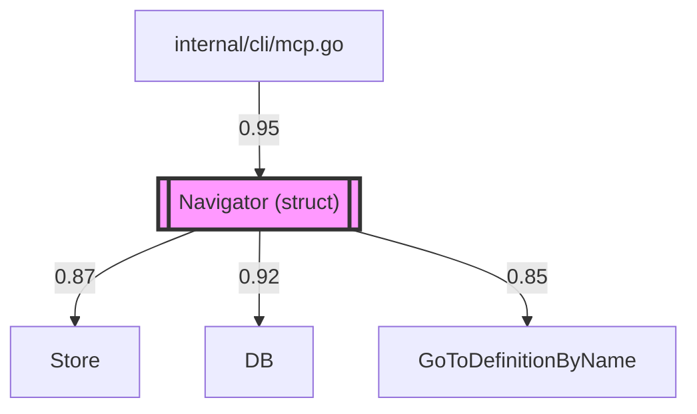
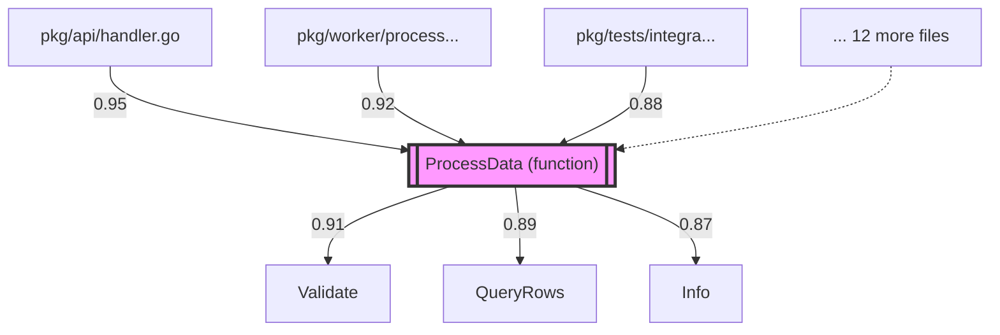

# Dependency Graph for Navigator (struct)

**Location**: internal/indexer/navigation.go:38:5
**Signature**: `type Navigator struct`

**Definition Candidates**: 1
- [1] Navigator (struct) at internal/indexer/navigation.go:38

## File Dependency Graph

## Symbol Dependency Graph

**Nodes**: 8 | **Edges**: 15 (12 inbound, 3 outbound)

## Top Scored Usages

**Total**: 12 usages

1. **Navigator** at `internal/cli/mcp.go:141` (score: 0.9500)
   - Context: runMcp
2. **Navigator** at `internal/cli/mcp.go:265` (score: 0.9500)
   - Context: runMcp
3. **Navigator** at `internal/cli/mcp.go:295` (score: 0.9200)
   - Context: runMcp
4. **Navigator** at `internal/cli/mcp.go:302` (score: 0.9200)
   - Context: runMcp
5. **Navigator** at `internal/cli/mcp.go:326` (score: 0.8900)
   - Context: runMcp
6. **Navigator** at `internal/cli/mcp.go:334` (score: 0.8900)
   - Context: runMcp
7. **Navigator** at `internal/cli/mcp.go:370` (score: 0.8700)
   - Context: runMcp
8. **Navigator** at `internal/cli/mcp.go:385` (score: 0.8700)
   - Context: runMcp
9. **Navigator** at `internal/cli/mcp.go:404` (score: 0.8500)
   - Context: runMcp
10. **Navigator** at `internal/cli/mcp.go:425` (score: 0.8200)
   - Context: runMcp

*... and 2 more usages*

---

# Example: Complex Dependency Graph

This shows what the output looks like for a symbol with many dependencies:

## File Dependency Graph

## Symbol Dependency Graph

---

## Key Features of the Mermaid Output

1. **Two Graph Views**:
   - **File Dependency Graph** (LR - left to right): Shows which files depend on which files
   - **Symbol Dependency Graph** (TD - top to bottom): Shows the primary symbol with its inbound (who uses it) and outbound (what it uses) dependencies

2. **Visual Styling**:
   - Primary definition is highlighted with a thick border and distinctive color
   - Edge labels show dependency scores and usage counts
   - Nodes are automatically sanitized for Mermaid compatibility

3. **Smart Truncation**:
   - File paths are shortened for readability (max 30-40 chars)
   - Graphs are limited to top 15 edges by score to avoid clutter
   - "... N more" nodes indicate truncated content

4. **LLM-Native**:
   - Markdown formatting with sections
   - Mermaid diagrams can be directly rendered by most LLMs and markdown viewers
   - Structured data is also available in the JSON response for programmatic use

5. **Scored Usages**:
   - Listed with context container
   - Sorted by dependency score (descending)
   - Shows top 20 with summary count

This format makes it much easier for LLMs to:
- Visualize the dependency structure
- Understand risk when refactoring
- Identify high-confidence vs low-confidence dependencies
- See the full context of how a symbol is used across the codebase
