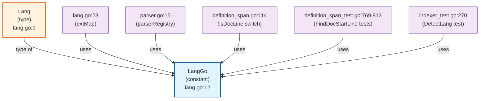

# LangGo Dependency Graph

## Overview
`LangGo` is a constant of type `Lang` defined in `internal/indexer/lang.go:12` with the value `"go"`.

## Dependency Graph



## Detailed Usage Locations

### 1. **lang.go:23** - Extension Map
```go
var extMap = map[string]Lang{
    ".go":   LangGo,
    // ...
}
```
Maps the `.go` file extension to `LangGo`.

### 2. **parser.go:15** - Parser Registry
```go
parserRegistry[LangGo] = &GoParser{}
```
Registers the Go parser implementation for `LangGo`.

### 3. **definition_span.go:114** - Documentation Line Detection
```go
func isDocLine(trimmed string, lang Lang) bool {
    switch lang {
    case LangGo:
        return strings.HasPrefix(trimmed, "//") ||
            strings.HasPrefix(trimmed, "/*") ||
            // ...
    }
}
```
Used to detect Go-style documentation comments.

### 4. **definition_span_test.go:769,813** - Test Cases
Used in test cases for `FindDocStartLine` function with Go code examples.

### 5. **indexer_test.go:270** - Language Detection Test
```go
{"foo.go", LangGo},
```
Used in test cases for `DetectLang` function.

## Summary

- **Outbound Dependencies (1):**
  - `Lang` type (the type that `LangGo` is an instance of)

- **Inbound Dependencies (5 files, 6 usages):**
  - `lang.go` - Extension mapping
  - `parser.go` - Parser registration
  - `definition_span.go` - Documentation detection
  - `definition_span_test.go` - Test cases (2 usages)
  - `indexer_test.go` - Test cases

All usages have a dependency score of 1.0000, indicating strong, direct dependencies.
